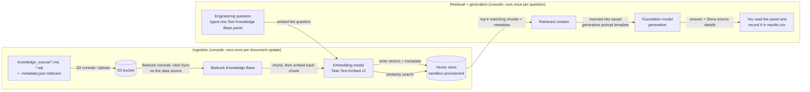

# Architecture Overview — Usage Metering & Billing Knowledge Base

## Flow diagram

## Why this shape, in plain language

- **Ingestion and retrieval are separate processes that happen at different times.**
  Ingestion is the Sync step and is infrequent — you only re-run it when the source
  documents change. Retrieval is cheap and happens on every single question typed into
  the test panel. Keeping them separate means answering a question never involves
  re-reading and re-chunking every document from scratch.
- **The vector store is the thing that makes retrieval fast.** Without it, answering a
  question would require comparing it against every chunk of every document one by one.
  The vector store is built (via an index) to find the closest matches quickly even as
  the document set grows.
- **The same embedding model must be used for both ingestion and retrieval.** Different
  embedding models produce number-lists in different, incompatible "spaces" — comparing
  a question embedded with one model against chunks embedded with a different model
  would produce meaningless results. This is why the Knowledge Base wizard lets you pick
  the embedding model only once, at creation time, rather than per question.
- **Generation only sees what retrieval hands it.** The foundation model does not have
  independent access to the S3 bucket or the vector store — the only source material it
  ever sees is whatever chunks retrieval returned for that specific question. This is
  *why* grounding and abstention work the way they do: if retrieval didn't find anything
  relevant, generation has nothing to answer from, and the saved prompt template tells it
  to say so rather than fall back on the model's general knowledge.

## Production-level considerations (beyond a bare-minimum lab setup)

This lab is built to sandbox-appropriate defaults using only the console, but is
documented against what a real production deployment would additionally need, since
that's the framing of this assessment:

| Concern | This lab | What production adds |
|---|---|---|
| Access control | Sandbox-provided IAM role, scoped by the admin, selected in the console wizard | Least-privilege IAM roles per component (a role that can sync data can't also delete the Knowledge Base; a query-only role can never call Sync) |
| Data at rest | Default S3 encryption (SSE-S3) | Customer-managed KMS keys, bucket policies denying unencrypted uploads |
| Auditability | Manual review of `results.csv` | Every retrieval logged (CloudWatch/CloudTrail) with the question, retrieved chunk IDs, and citations, retained per your org's audit policy |
| Change control | Manual re-upload + re-sync after editing a source doc | Source documents in version control (Git), sync triggered by a CI/CD pipeline on merge, not clicked by hand |
| Repeatability | Every setting clicked by hand in the console, once | Infrastructure as code (CloudFormation/Terraform/CDK) so the same Knowledge Base configuration can be recreated identically in another environment |
| Metadata governance | Four hand-written `.metadata.json` files | A metadata schema enforced at write time, with `classification` driving actual access filtering, not just a label |
| Monitoring | This assessment's manual grounding review | Automated, ongoing sampling of live questions against the same grounding checklist, alerting when the abstention rate or ungrounded-answer rate crosses a threshold |
| Model/version pinning | One embedding model and one generation model, chosen once in the console | Formal model version change management — re-running the full assessment before promoting a new model version, since a model swap can change retrieval and grounding behavior |

Note the tradeoff explicitly: doing this lab by hand in the console is the right choice
for learning the mechanics step by step, but the "Repeatability" and "Change control"
rows above are exactly where a real production deployment would move to
infrastructure-as-code and CI/CD instead of console clicks — worth naming if asked about
this in a review.

## Where each step fits (console-only)

1. **S3 console — Upload** — puts the four source documents (and their metadata
   sidecars) into S3. This is the "raw material" step.
2. **Bedrock console — Create Knowledge Base wizard** — creates the Knowledge Base and
   its S3 data source, pointing at the sandbox's pre-provisioned vector store. Run once.
3. **Bedrock console — Sync button** — triggers chunking + embedding + vector store
   writes for the data source. Re-click this any time a source document changes.
4. **Bedrock console — Test Knowledge Base panel** — ask one question, see the answer,
   citations, and (once configured) abstention behavior. Use this to sanity-check the
   system before running the full assessment.
5. **You, by hand** — run all 13 assessment questions through the same test panel and
   record each into `assessment/results.csv`; optionally tally the results with
   `assessment/score_results.py`, the one local script in this package.
